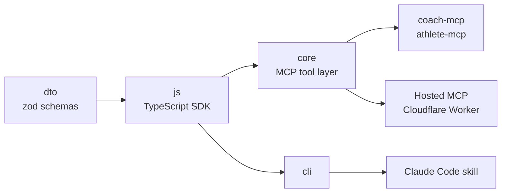

The toolkit has four entry points over the same TrainHeroic client and typed data shapes. Pick
the one that matches who drives the work, and the page shows that surface's first request.

| If you need to…                            | Start with…                            |
| ------------------------------------------ | -------------------------------------- |
| Ask Claude Code to work with your account  | [Claude Code skill](/developers/skill) |
| Run repeatable shell commands or emit JSON | [CLI](/developers/cli)                 |
| Build an application or automation         | [TypeScript SDK](/developers/sdk)      |
| Connect an AI client to typed tools        | [MCP server](/developers/mcp)          |

<View title="Skill" icon="sparkles">

## First request with the skill

The skill teaches Claude Code the TrainHeroic workflows and runs the CLI for each step.

```console
$ npx skills add alandotcom/trainheroic-unofficial
$ export TRAINHEROIC_EMAIL=coach@example.com
$ export TRAINHEROIC_PASSWORD=yourpassword
$ claude
```

<Prompt description="Ask for last week's training." actions={["copy"]}>
  /trainheroic-unofficial Which athletes on my roster trained last week, and who missed sessions?
</Prompt>

Read the [skill guide](/developers/skill) for the athlete variant and the version-matched
reference.

</View>

<View title="CLI" icon="terminal">

## First request with the CLI

Every command prints JSON to stdout, so you can pipe it into `jq` or another program.

```console
$ npm install -g @trainheroic-unofficial/cli
$ export TRAINHEROIC_EMAIL=athlete@example.com
$ export TRAINHEROIC_PASSWORD=yourpassword
$ trainheroic athlete workouts --start 2026-08-01 --end 2026-08-31
```

Read the [CLI guide](/developers/cli) for coach commands, JSON input, and confirmation flags.

</View>

<View title="SDK" icon="braces">

## First request with the SDK

```package-install
@trainheroic-unofficial/js
```

```ts
import { TrainHeroicClient, fetchAthleteProfileSummary, resolveAthleteUserId } from "@trainheroic-unofficial/js";

const client = new TrainHeroicClient(process.env.TRAINHEROIC_EMAIL!, process.env.TRAINHEROIC_PASSWORD!);

const userId = await resolveAthleteUserId(client);
console.log(await fetchAthleteProfileSummary(client, userId));
```

Read the [SDK guide](/developers/sdk) for auth behavior, the exercise library, workout building,
and analytics.

</View>

<View title="MCP" icon="plug">

## First request over MCP

Add the hosted server to Claude Code. It opens the TrainHeroic sign-in the first time a tool runs.

```console
$ claude mcp add trainheroic --transport http {{mcp-url}}
```

<Prompt description="Ask through the connected tools." actions={["copy"]}>
  Show my back squat PRs from this year.
</Prompt>

Read the [MCP guide](/developers/mcp) for other clients, role-scoped endpoints, and local stdio
servers.

</View>

## How the pieces fit

Every surface reuses the layer below it, so a fix in the SDK reaches the CLI and every MCP
server in the same release.



## Runtime requirements

Published packages require Node 18 or a modern runtime with `fetch` and Web Crypto. Developing
the monorepo itself requires Node 24 and pnpm 11.

:::warning
The TrainHeroic API is undocumented. Pin package versions in production and expect upstream
responses to change occasionally.
:::
